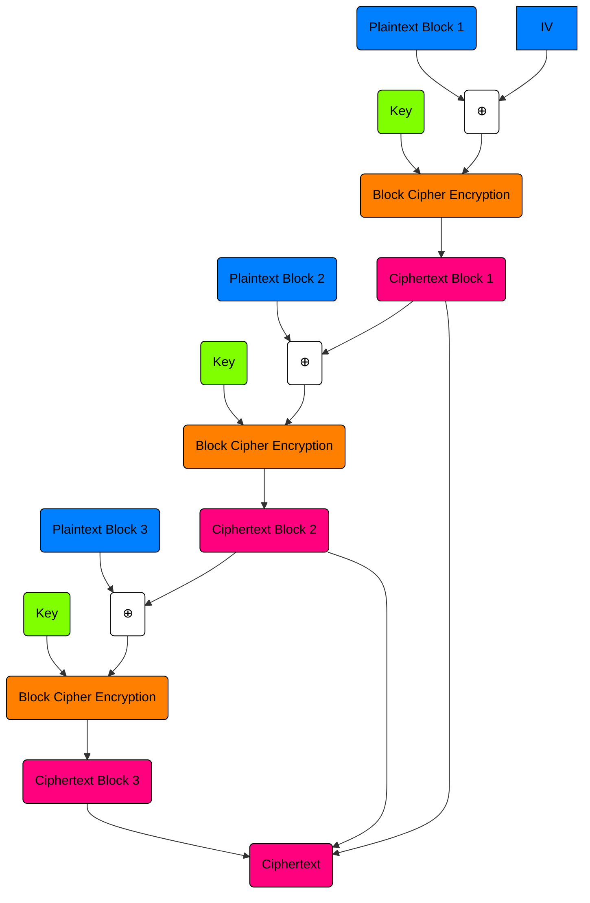
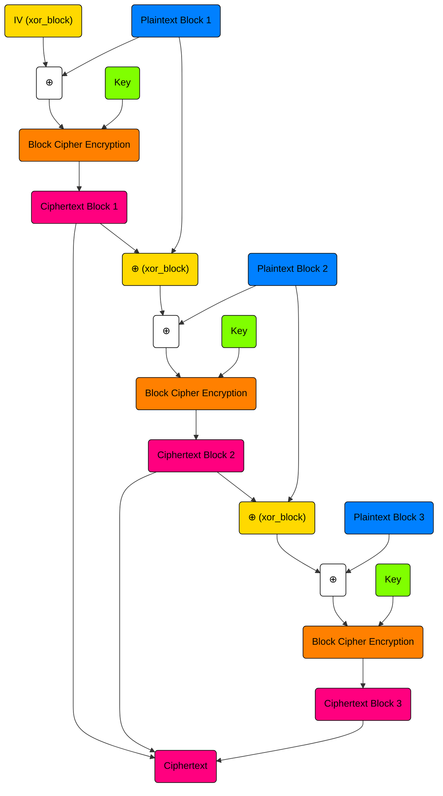

# Cryptography transcends wizardry

## The Challenge
In this challenge, the user connects to the server and is prompted with the following question:
```
What properties should your magic wand have?
```
Following this, the user can input any property in hex which is then added as a characteristic for a magic wand, this is reapeated three times. Should the user input repeated properties, then the program will prompt:
```
Only different properties are allowed!
```
and following this prompt will exit. A full example of a server interaction is as so:
```
What properties should your magic wand have?
Property: FF
7addf85ef83df437c4f7054a1fa2f042
Property: 0F
7fefc70a079f8966b9b6c25418d9265f
Property: FF
Only different properties are allowed!
```
## Overall Program Function
In order to better understand the function of the server, it is necessary to delve into its decision making code.
```python
def main():
    aes = AESWCM(KEY)
    tags = []
    characteristics = []
    print("What properties should your magic wand have?")
    message = "Property: "

    counter = 0
    while counter < 3:
        characteristic = bytes.fromhex(input(message))
        if characteristic not in characteristics:
            characteristics.append(characteristic)

            characteristic_tag = aes.tag(message.encode() + characteristic, IV)
            tags.append(characteristic_tag)
            print(characteristic_tag)

            if len(tags) > len(set(tags)):
                print(FLAG)

            counter += 1
        else:
            print("Only different properties are allowed!")
            exit(1)
```
The program begins as observed above, with a prompt for a magic wand characteristic. Following this, the chracteristic is converted to bytes, and added to a list of prior  characteristics if it is unique. The characterstic is then encrypted using the provided custom AESWCM class and appended to a list of prior AES encrypted tags. The flag is revealed if the length of the tag list is greater than the length of the set of the tags list; that is, if there is a duplicate in the tag list then the flag is printed. Therefore, all that must be achieved to determine the flag is AES collision; however, AES is not a hash function and there are no collisions, so there must be some error in the provided AESWCM class that facilitates a collision.
## Encryption Analysis
Beginning our analysis of the `AESWCM` class, let us briefly go through `AESWCM.__init__`.
```python
    def __init__(self, key):
        self.key = key
        self.cipher = AES.new(self.key, AES.MODE_ECB)
        self.BLOCK_SIZE = 16
```
Within this constructor, there are three important variables created.
1. $self.key$
2. $self.cipher$
3. $self.BLOCK\\_SIZE$

$self.key$ is aptly named because it is the key to the `AES` encryption method implemented within the `AESWCM` class. What `AES` mode is used, you might ask? Well, using my top notch detective skills (I out the NSA to shame) on the assignment of `self.cipher` to `AES.new(self.key, AES.MODE_ECB)` I think it is safe to say we are using `AES-ECB`, which is an insecure `AES` encryption standard that I will discuss momentarily. The final variable declared is $self.BLOCK\\_SIZE$ which simply designates the number of bytes per *block* for the `AES-ECB` encryption.
### A Review of AES-ECB
Let's take a brief moment to review `AES-ECB` and why it is one of the more (if not most) insecure `AES` modes. To begin, `AES-ECB` is a block cipher, meaning that it splits a plaintext into blocks of a particular number of bytes. In our case, `self.BLOCK\\_SIZE` is $16$, meaning that the plaintext encrypted will be split into block of size $16$ bytes. For instance, consider the following example:
```
pt = "000000000000000000000000000000000101010101010101010101010101010102020202020202020202020202020202"
pt_blocks = blockify(pt)
# pt_blocks = ["00000000000000000000000000000000", "01010101010101010101010101010101", "02020202020202020202020202020202"]
```
A single hex *'digit'* is $1$ nibble; that is, $\frac{1}{2}$ a byte. Therefore, a block of size $16$ bytes with hex would have $32$ hex *'digits'* as shown above. Following this split of the plaintext ($pt$) into blocks, each block is then individually encrypted using the same key in the process of standard `AES` block encryption.

The issue and vulnerability in `AES-ECB` is that every single block is encrypted with the same key such that if the plaintext of one block is known, then any other reoccurences of identical ciphertext indicate the known plaintext. Consider the following:
```python
pt_1 = "mega secret msg:"
pt_2 = "mega secret msg: do not use AES pwds"
# Omiited blocking of plaintexts 
# Ommitted encryption calls
ct_1 = "18b44cd1683cf0b227de75a43a5b2f46"
ct_2 = "18b44cd1683cf0b227de75a43a5b2f462357ff9ee5b21a1b9b2464644b094823"
# The first 16 bytes of both ciphertexts are the same because they the same plaintext
```
This is one of the primary ways in which `AES-ECB` is vulnerable to attacks, the same plaintext will result in the same ciphertext every time. Now that `AES-ECB` has been briefly reviewed, let us move onto some `AESWCM` class functions
### pad Function
As priorly discussed, `AES-ECB` is a block cipher and encrypts blocks of a particular size (in this case $16$ bytes); however, what if a block has $<16$ bytes? Well, this is where padding comes in, it essentially adds bytes of information to the end of a block until it is the required encryption size. This particular function really just calls the padding function defined in `Crypto.Util.Padding` so long as $len(pt)\not\equiv0\hspace{.15cm}mod\hspace{0.15cm}self.BLOCK\\_SIZE$.
```python
    def pad(self, pt):
        if len(pt) % self.BLOCK_SIZE != 0:
            pt = pad(pt, self.BLOCK_SIZE)
        return pt
```
An example output from this function is as such:
```python
pt = b'pad this'
# pt_pad = pad(pt)
pt_pad = b'pad this\x08\x08\x08\x08\x08\x08\x08\x08'
```
### blockify Function
The aptly named `blockify` function is quite straightforward. Essentially, it accepts a byte array $message$ parameter and splits it into *blocks* with a size of $self.BLOCK\\_SIZE$ bytes. 
```python
    def blockify(self, message):
        return [
            message[i:i + self.BLOCK_SIZE]
            for i in range(0, len(message), self.BLOCK_SIZE)
        ]
```
An example output from this function is as such:
```python
pt = b'blockify this message please and thank you :)'
pt_blocks = [b'blockify this me', b'ssage please and', b' thank you :)']
```
### xor Function
The `xor` function does exactly as the name implies and xors two $16$ element byte arrays together. XOR is also known as the eXclusive OR (XOR) function, $\oplus$ is the typical math notation for xor, ^ is the bitwise operator for xor in python. It has the following operation:
| $A$ | $B$ | $A\oplus B$ |
| --- | --- | --- |
| 0 | 0 | 0 |
| 0 | 1 | 1 |
| 1 | 0 | 1 |
| 1 | 1 | 0 |  

Additionally, it has several useful properties:
- $A\oplus 0 = A$
- $A\oplus A=0$
- $(A\oplus B)\oplus C = A\oplus (B\oplus C)$
- $A\oplus B = B\oplus A$
- $A\oplus B=C \Rightarrow A\oplus C = B \wedge C\oplus B = A$  
For this challenge in particular, the most important properties are $\oplus$'s commutativity property and the fact that to undo a $\oplus$ you perform $oplus$ on the result with either $term$ (The last property in the list above)
### Encrypt Function
Now that the `blockify`, `xor` and `pad` functions have been discussed, the main encryption function can be looked at.
```python
    def encrypt(self, pt, iv):
        pt = self.pad(pt)
        blocks = self.blockify(pt)
        xor_block = iv

        ct = []
        for block in blocks:
            ct_block = self.cipher.encrypt(self.xor(block, xor_block))
            xor_block = self.xor(block, ct_block)
            ct.append(ct_block)

        return b"".join(ct).hex()
```
The first step of the `encrypt` function is for the message to be padded and then split into blocks using the aforementioned `pad` and `blockify` functions. Thereafter, a variable named $xor\\_block$ is set to the intermediate value ($IV$) which is the result of a Cryptographically Secure Psuedo-Random Number Generator (CSPRNG). Then, each $block$ is $\oplus$ed with $xor\\_block$ and subsequently encrypted using the `AES-ECB` objected created in `AESWCM.__init__`. A very important part of this process is that $xor\\_block$ is changed with each iteration be the $\oplus$ of the created $ct\\_block$ and $block$. This manual addition essentially turns the `AES-ECB` encryption into something similar to `AES-CBC` which we will quickly review.
### A Review of AES-CBC
Similarly to `AES-ECB`, `AES-CBC` is a block cipher and a provided plaintext is divided into blocks for encryption. However, unlike `AES-ECB`, each $pt$ block is $\oplus$ed with an Intermediate Value ($IV$) prior to encryption. The first $IV$ is a random number; however, all subsequent $IV$'s are generated from the $\oplus$ing of the generated $ct$ block with the next $pt$ block. This removes one of the primary vulnerabilities of `AES-ECB` where blocks consisting of the same plaintext receive the same ciphertext.

## Back to the encrypt Function
Now, returning to the `encrypt` function we notice a peculiarily. In typical `AES-CBC` implementation, there is not a $xor\\_block$ but instead the previous $ct$ is $\oplus$ed with the current $pt$ ($ct=IV$ in the case of the first block), this peculiarity will be important later on. Creating a flow chart for the actual `AESWCM` process provides the following:

### tag Function
The final funtion in the `AESWCM` class and the one called inside `main` is the `tag` function. This function acts as an outline for the entire creation process of a wand characteristic's tag and is incredibly important. Thankfully, it is also quite simple.
```python
    def tag(self, pt, iv=os.urandom(16)):
        blocks = self.blockify(bytes.fromhex(self.encrypt(pt, iv)))
        random.shuffle(blocks)

        ct = blocks[0]
        for i in range(1, len(blocks)):
            ct = self.xor(blocks[i], ct)

        return ct.hex()
```
A majority of the work performed by this function ocurrs within its first line where the encrypt function is called on the passed `pt` and subsequently split into blocks once more. These blocks are then randomly shuffled, and the first block in the `blocks` list is $\oplus$ed with every other block in `blocks` and then returned. See? It's pretty straightforward.
### Exploit
Now that we fully understand the happenings of the script, it is time to break it and cause a collision, and what better place to start than with the peculiar `AES-CBC` encryption within the `encrypt` function? 
## Conclusion
